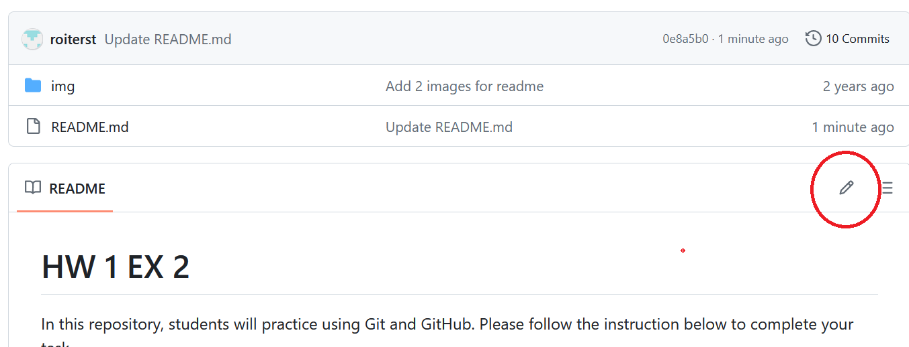

# Git-Exercise

In this repository, students will practice using Git and GitHub. Please follow the instruction below to complete your task.

## Step 1:
Fork this repository to your GitHub.


i. Click on the [fork] icon on the right-hand upper corner on the page.  
ii. Select your account and confirm forking.

## Step 2:
Clone the repository to your local device.

**cd** to Desktop and use the following command in the termial:

```
git clone <Repo SSH>
```

## Step 3:
Create a new jupyter notebook file and name the file with this pattern: \<STAT315_ID_***>_test.ipynb

e.g. STAT315_ID_999.ipynb  if your STAT315 ID is 999

In this jupyter notebook file, students need to type the following in a code block and write a short comment to describe the code.
  
``` python
x = [10, 20, 30, 40, 50]
y = [1, 2, 3, 4, 5]

result = []
for i in x:
  for j in y:
    result.append(i * j)

print(result)
```
  
**Note:** Make sure you save the file after you finish writing the code and print out the result.

## Step 4:
Push the update to the remote repository on GitHub.

Use the following command:

**Note:** The following command should be in the repository directory.  Make sure you **cd** to the repo directory on your device before running the command below.

i. Adding the update / change to **staging**
```
git add .
```

ii. Committing the update / changes
```
git commit -m '<simple discription of the update / change>'
```
e.g. git commit -m 'add new notebook to the project'

iii. Pushing the update / change back to the cloud or remote repo
```
git push
```

## Step 5:
Add your STAT315 ID to the readme file.



i. Click on the pen icon on the right-hand upper corner of the readme section.  
ii. Edit the readme document by adding your name to the document.

e.g. \#Git-Exercise by STAT315 ID 999

## Step 6:
Pull the updated readme back to the local device.

Use the following command:
```
git pull

```
## Step 7: 
Enable grading by adding Matthew (the TA)  as a collaboratorto your project:
Navigate to your project.

1. Go toSettings. If youdo not see the button, then in the top-right click to open the menu.
2. In the menu, click Settings to access the project settings.
3. On the left choose Collaborators
4. Click Manage access.
5. Cleci the Add Members button
6. Add Matthew with his email *****@tamu.edu
7. Check that adding the TA to your project was successful.  If it was, you should see that the invite is pending Matthew's acceptance in the "Manage Access" section of Settings. 

## Resources:
Git Cheat Sheet: https://education.github.com/git-cheat-sheet-education.pdf  
GitHub Documentation: https://docs.github.com/en/repositories
